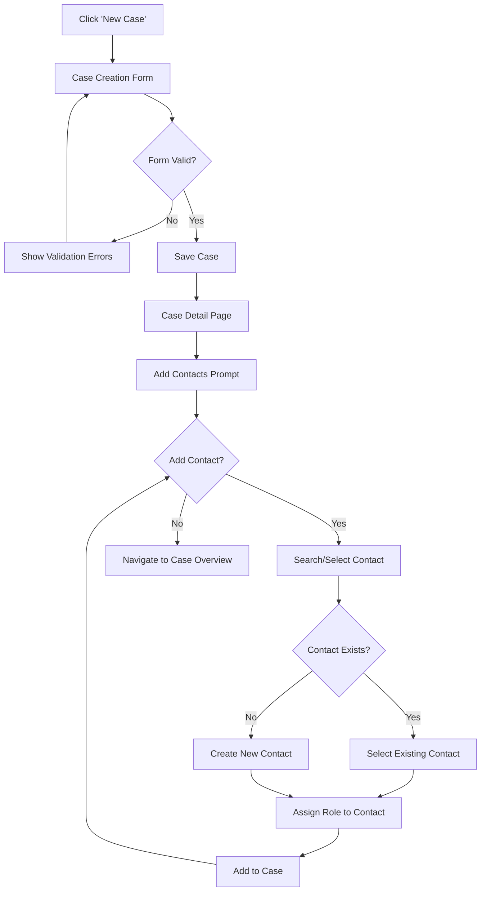
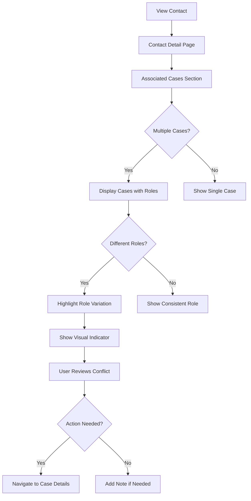
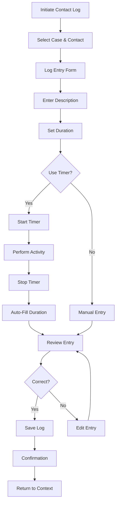
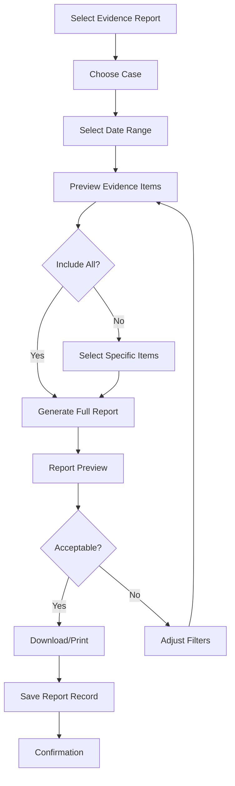
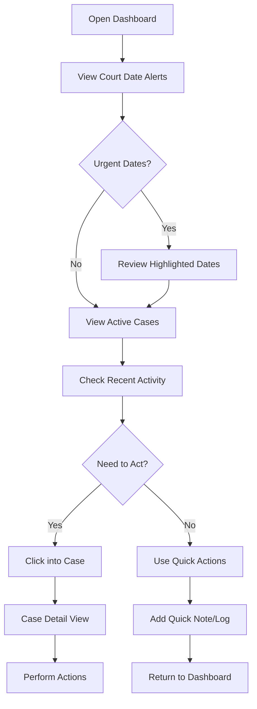

# Case Track UX/UI Specification

_Generated on 2025-10-17 by UX/UI Research & Implementation_

## Executive Summary

Case Track is a specialized web-based application designed for mental health therapists managing court-involved reunification cases. This UX/UI specification establishes a comprehensive design system that prioritizes accessibility, supports dark mode, and follows modern best practices for healthcare applications. The design emphasizes clarity, efficiency, and emotional sensitivity appropriate for mental health professionals working in high-stakes legal contexts.

**Key Design Objectives:**
- Create a professional, calming interface suitable for mental health work
- Ensure WCAG 2.1 AA accessibility compliance
- Provide seamless light and dark mode experiences
- Support efficient workflows for time-sensitive court documentation
- Enable clear visibility of complex multi-case relationships
- Reduce cognitive load through thoughtful information hierarchy

---

## 1. UX Goals and Principles

### 1.1 Target User Personas

#### Primary Persona: Sarah - Court-Involved Family Therapist

**Demographics:**
- Age: 35-55
- Experience: 7+ years in family therapy, 3+ years with court cases
- Technical proficiency: Moderate (comfortable with standard software)
- Work environment: Office-based with occasional remote work

**Goals:**
- Track complex relationships across multiple concurrent court cases
- Document interactions precisely for legal compliance
- Quickly identify potential role conflicts across cases
- Generate court reports efficiently under tight deadlines
- Maintain confidential, organized case documentation

**Pain Points:**
- Current tools (spreadsheets) lack cross-case visibility
- Time-consuming to track same individuals across different cases
- Difficult to maintain accurate time logs for billing
- Risk of missing court dates across multiple cases
- Challenge keeping evidence reviews organized

**Usage Patterns:**
- Accesses system 3-5 times daily
- Peak usage: mornings (planning) and late afternoons (documentation)
- Needs quick access to upcoming court dates
- Requires mobile access for notes during sessions
- Values keyboard shortcuts for efficiency

#### Secondary Persona: Michael - Practice Administrator

**Demographics:**
- Age: 30-45
- Role: Manages small therapy practice (2-3 therapists)
- Technical proficiency: High

**Goals:**
- Oversee multiple therapists' caseloads
- Ensure billing accuracy through time tracking
- Monitor case status and deadlines
- Generate practice-wide reports

**Pain Points:**
- Difficulty aggregating data across therapists
- Time-consuming billing reconciliation
- Limited visibility into practice capacity

### 1.2 Usability Goals

1. **Learnability**
   - New users can create their first case within 10 minutes
   - Core workflows accessible without training through clear labeling
   - Consistent patterns reduce learning curve

2. **Efficiency for Power Users**
   - Keyboard shortcuts for frequent actions
   - Quick search across all entities
   - Batch operations for common tasks
   - Customizable dashboard for personal workflow

3. **Error Prevention and Recovery**
   - Clear warnings before destructive actions
   - Automatic saving of form progress
   - Undo capability for recent changes
   - Validation that prevents data entry errors

4. **Accessibility**
   - Full WCAG 2.1 AA compliance
   - Screen reader compatibility
   - Keyboard navigation for all functions
   - Adjustable text sizes and contrast modes

5. **Emotional Appropriateness**
   - Professional yet empathetic tone
   - Calming color palette that reduces stress
   - Clear information hierarchy reduces anxiety
   - Respectful handling of sensitive information

### 1.3 Design Principles

#### 1. **Clarity Over Cleverness**
Information density is appropriate, but clarity is paramount. Use clear labels, obvious affordances, and straightforward navigation. Avoid clever UI patterns that require explanation.

#### 2. **Professional Calm**
The interface should feel professional and competent while maintaining a calming presence. This is a tool for serious work in emotionally charged contexts—design should support focus and reduce stress.

#### 3. **Respectful Efficiency**
Speed up repetitive tasks while being respectful of the sensitive nature of the work. Quick actions should never feel rushed or careless.

#### 4. **Progressive Disclosure**
Show essential information first, with details available on demand. Don't overwhelm users with every data point simultaneously.

#### 5. **Universal Access**
Design for accessibility from the ground up, not as an afterthought. Every feature must work for all users, including those using assistive technologies.

---

## 2. Information Architecture

### 2.1 Site Map

```
Case Track Application
│
├── Dashboard (Home)
│   ├── Upcoming Court Dates Widget
│   ├── Active Cases Overview
│   ├── Recent Activity Feed
│   └── Quick Actions Panel
│
├── Cases
│   ├── Case List (with filters/search)
│   ├── Case Detail
│   │   ├── Overview Tab
│   │   ├── Contacts Tab
│   │   ├── Kanban Board Tab
│   │   ├── Evidence Review Tab
│   │   ├── Contact Logs Tab
│   │   └── Court Dates Tab
│   └── Create New Case
│
├── Contacts
│   ├── Contact List (with search)
│   ├── Contact Detail
│   │   ├── Overview
│   │   ├── Associated Cases (with roles)
│   │   ├── Contact History
│   │   └── Notes
│   └── Create New Contact
│
├── Reports
│   ├── Evidence Report Generator
│   ├── Contact Log Summary
│   ├── Time Tracking Report
│   └── Case Status Summary
│
└── Settings
    ├── Profile & Preferences
    ├── Template Customization
    ├── Field Definitions
    └── System Configuration
```

### 2.2 Navigation Structure

#### Primary Navigation (Top Bar)
- **Logo/Home**: Return to dashboard
- **Cases**: Access case management
- **Contacts**: Access contact management  
- **Reports**: Generate reports
- **Settings**: System configuration
- **User Menu**: Profile, preferences, logout

#### Secondary Navigation (Contextual)
- Within Case Detail: Tab-based navigation for different aspects
- Within Contact Detail: Tab-based navigation for information
- Breadcrumb trail for deep navigation paths

#### Mobile Navigation Strategy
- Collapsible hamburger menu for primary navigation
- Bottom navigation bar for main sections on mobile devices
- Swipe gestures for tab navigation
- Pull-to-refresh for data updates

---

## 3. User Flows

### 3.1 User Flow: Create New Case and Add Contacts

**User Goal:** Set up a new court case with associated contacts and their roles

**Entry Points:**
- Dashboard "New Case" button
- Cases page "Add Case" action
- Quick action menu

**Flow Steps:**



**Success Criteria:**
- Case created with unique case number
- At least one contact assigned with role
- Court date added if known
- User lands on case detail page ready to work

**Error States:**
- Duplicate case number warning
- Missing required fields highlighted
- Network error recovery with local draft saving

### 3.2 User Flow: Identify Cross-Case Role Conflicts

**User Goal:** Discover if a contact serves multiple roles across different cases

**Entry Points:**
- Contact detail page
- Dashboard alerts
- Contact search results

**Flow Steps:**



**Success Criteria:**
- User immediately sees all cases where contact appears
- Role conflicts are visually distinct
- Quick navigation to affected cases
- Option to add notes about the conflict

**Visual Design:**
- Use color coding for role types
- Visual badge/indicator for conflicts
- Clear table showing case name, role, and dates

### 3.3 User Flow: Log Contact Interaction with Time Tracking

**User Goal:** Record a therapy session or phone call with time tracking for billing

**Entry Points:**
- Case detail page
- Contact detail page
- Quick action from dashboard
- Mobile quick add

**Flow Steps:**



**Success Criteria:**
- Contact log saved with accurate time
- Entry linked to correct case and contact
- Duration accurately captured
- Immediately visible in case history

**Special Considerations:**
- Built-in timer option for real-time tracking
- Recent contacts suggested for quick selection
- Default duration based on typical session length
- Offline capability with sync when reconnected

### 3.4 User Flow: Generate Evidence Report for Court

**User Goal:** Create a formatted evidence review report for court submission

**Entry Points:**
- Case detail page "Generate Report"
- Reports section
- Court date reminder

**Flow Steps:**



**Success Criteria:**
- Report generated with all required evidence
- Formatted for court submission
- Date range accurately applied
- PDF downloadable
- Record kept of report generation

**Report Contents:**
- Case identifying information
- Date range of evidence
- Chronological list of reviewed materials
- Material type, title, review date
- Therapist notes on each item
- Professional signature section

### 3.5 User Flow: Quick Dashboard Overview and Case Access

**User Goal:** Start the work day by reviewing priorities and accessing active cases

**Entry Points:**
- Login
- Application home

**Flow Steps:**



**Success Criteria:**
- All urgent court dates visible immediately
- Active cases status clear at a glance
- Recent activity provides context
- Quick actions available without deep navigation
- Dashboard loads in under 2 seconds

---

## 4. Component Library and Design System

### 4.1 Design System Approach

**Foundation:** Material UI (MUI) v5 with Custom Theme

**Rationale:**
- Comprehensive accessibility built-in
- Strong TypeScript support
- Excellent dark mode support
- Extensive component library reduces custom development
- Well-documented and maintained
- Themeable for customization

**Customization Strategy:**
- Extend MUI theme with custom color palette
- Override component defaults for consistent styling
- Create custom composite components for domain-specific needs
- Maintain MUI accessibility features while customizing appearance

### 4.2 Core Components

#### Navigation Components

**1. Primary Navigation Bar**
- **Purpose:** Top-level application navigation
- **Variants:**
  - Desktop: Full horizontal navigation
  - Mobile: Collapsible menu
- **States:** Default, Active item, Hover
- **Accessibility:** ARIA landmarks, keyboard navigation, skip links

**2. Breadcrumb Trail**
- **Purpose:** Show navigation hierarchy
- **States:** Default, Hover
- **Accessibility:** aria-label="Breadcrumb"

#### Data Display Components

**3. Case Card**
- **Purpose:** Display case summary in lists and dashboard
- **Variants:**
  - Compact: List view
  - Expanded: Dashboard widget
- **States:**
  - Default
  - Hover (with shadow elevation)
  - Active (selected)
  - Alert (urgent court date)
- **Contents:**
  - Case name and number
  - Status badge
  - Next court date
  - Contact count
  - Quick actions menu
- **Accessibility:** Semantic headings, clear labels, keyboard accessible actions

**4. Contact Role Badge**
- **Purpose:** Indicate contact's role in a case
- **Variants:**
  - Small (inline)
  - Medium (cards)
  - Large (headers)
- **States:**
  - Default role
  - Conflict indicator (multiple roles)
- **Color Coding:**
  - Guardian Ad Litem: Blue
  - Friend of Court: Green  
  - Attorney: Purple
  - Therapist: Teal
  - Social Worker: Orange
- **Accessibility:** Not color-only (includes icons/text), aria-label with full role name

**5. Status Indicator**
- **Purpose:** Show case/task status
- **Variants:**
  - Dot indicator
  - Badge with text
  - Progress indicator
- **States:**
  - Active (green)
  - Waiting List (amber)
  - Closed (gray)
- **Accessibility:** Status text always present, not color-only

#### Form Components

**6. Smart Contact Selector**
- **Purpose:** Search and select contacts with quick-add capability
- **Features:**
  - Autocomplete search
  - Recent contacts quick list
  - "Add new contact" inline option
  - Show existing cases for selected contact
- **States:** Default, Focus, Error, Success
- **Accessibility:** Autocomplete ARIA patterns, clear focus indicators

**7. Duration Input**
- **Purpose:** Enter time duration with multiple formats
- **Features:**
  - Timer mode (start/stop)
  - Manual entry (minutes or hours:minutes)
  - Quick duration buttons (15min, 30min, 60min)
- **States:** Default, Active (timing), Paused, Completed
- **Accessibility:** Clear labels, timer status announced to screen readers

**8. Date Range Picker**
- **Purpose:** Select date ranges for reports and filters
- **Features:**
  - Calendar picker
  - Preset ranges (This Week, This Month, Last 30 Days)
  - Custom range
- **States:** Default, Open, Selected
- **Accessibility:** Keyboard date selection, clear labels for range start/end

#### Action Components

**9. Quick Action Menu**
- **Purpose:** Context-specific actions available anywhere
- **Variants:**
  - Floating action button (mobile)
  - Menu button (desktop)
- **Actions:**
  - Add contact log
  - Create case
  - Add contact
  - Quick note
- **Accessibility:** aria-label, keyboard accessible, screen reader friendly

**10. Confirmation Dialog**
- **Purpose:** Confirm destructive or significant actions
- **States:** Warning, Error, Info
- **Features:**
  - Clear action description
  - Cancel/Confirm buttons (distinct styling)
  - Optional "Don't show again" for low-risk actions
- **Accessibility:** Focus trap, Escape to cancel, clear button labels

#### Specialized Components

**11. Kanban Board**
- **Purpose:** Visual task management
- **Features:**
  - Drag-and-drop between columns
  - Keyboard-based movement
  - Column customization
- **States:** Default, Dragging, Drop target
- **Accessibility:** Keyboard navigation, screen reader announcements for moves

**12. Court Date Alert**
- **Purpose:** Highlight upcoming court deadlines
- **Variants:**
  - Critical (within 7 days): Red accent
  - Warning (8-14 days): Amber accent
  - Info (15-30 days): Blue accent
- **Features:**
  - Countdown display
  - Quick link to case
  - Add to calendar option
- **Accessibility:** Clear urgency indicators beyond color, semantic headings

**13. Evidence Review Item**
- **Purpose:** Display logged evidence review
- **Features:**
  - Material type icon
  - Review date
  - Notes preview
  - Quick edit/delete
- **States:** Default, Hover, Editing
- **Accessibility:** Clear labels, semantic structure

---

## 5. Visual Design Foundation

### 5.1 Color Palette

#### Light Mode Palette

**Primary Colors (Professional Blue)**
- Primary 50: `#E3F2FD` - Lightest background
- Primary 100: `#BBDEFB` - Light backgrounds
- Primary 200: `#90CAF9` - Disabled states
- Primary 300: `#64B5F6` - Hover states
- Primary 400: `#42A5F5` - Active states
- Primary 500: `#2196F3` - Main brand color
- Primary 600: `#1E88E5` - Primary button hover
- Primary 700: `#1976D2` - Primary button default
- Primary 800: `#1565C0` - Active/pressed
- Primary 900: `#0D47A1` - Darkest text

**Secondary Colors (Calming Teal)**
- Secondary 50: `#E0F2F1`
- Secondary 100: `#B2DFDB`
- Secondary 200: `#80CBC4`
- Secondary 300: `#4DB6AC`
- Secondary 400: `#26A69A`
- Secondary 500: `#009688` - Main secondary
- Secondary 600: `#00897B`
- Secondary 700: `#00796B`
- Secondary 800: `#00695C`
- Secondary 900: `#004D40`

**Semantic Colors**
- Success: `#4CAF50` (Green) - Successful actions, active status
- Warning: `#FF9800` (Amber) - Warnings, upcoming deadlines
- Error: `#F44336` (Red) - Errors, critical alerts, urgent deadlines
- Info: `#2196F3` (Blue) - Informational messages

**Neutral Colors**
- Gray 50: `#FAFAFA` - Page background
- Gray 100: `#F5F5F5` - Card background
- Gray 200: `#EEEEEE` - Dividers, disabled backgrounds
- Gray 300: `#E0E0E0` - Borders
- Gray 400: `#BDBDBD` - Disabled text
- Gray 500: `#9E9E9E` - Secondary text
- Gray 600: `#757575` - Icon colors
- Gray 700: `#616161` - Primary text
- Gray 800: `#424242` - Headings
- Gray 900: `#212121` - High emphasis text

**Text Colors**
- Primary Text: `rgba(0, 0, 0, 0.87)`
- Secondary Text: `rgba(0, 0, 0, 0.60)`
- Disabled Text: `rgba(0, 0, 0, 0.38)`
- Hint Text: `rgba(0, 0, 0, 0.38)`

#### Dark Mode Palette

**Primary Colors (Softer Blue for Dark)**
- Primary 50: `#0D47A1` - Darkest (reversed)
- Primary 100: `#1565C0`
- Primary 200: `#1976D2`
- Primary 300: `#1E88E5`
- Primary 400: `#2196F3`
- Primary 500: `#42A5F5` - Main brand in dark mode
- Primary 600: `#64B5F6`
- Primary 700: `#90CAF9`
- Primary 800: `#BBDEFB`
- Primary 900: `#E3F2FD` - Lightest (reversed)

**Secondary Colors (Softer Teal for Dark)**
- Secondary 500: `#4DB6AC` - Main secondary in dark mode
- (Similar reversal pattern)

**Semantic Colors (Dark Mode Adjusted)**
- Success: `#66BB6A` (Lighter green)
- Warning: `#FFA726` (Lighter amber)
- Error: `#EF5350` (Lighter red)
- Info: `#42A5F5` (Lighter blue)

**Neutral Colors (Dark Mode)**
- Gray 50: `#121212` - Page background (dark)
- Gray 100: `#1E1E1E` - Card background (dark)
- Gray 200: `#2C2C2C` - Elevated surfaces
- Gray 300: `#383838` - Borders
- Gray 400: `#4F4F4F` - Disabled backgrounds
- Gray 500: `#6B6B6B` - Disabled text
- Gray 600: `#909090` - Secondary text
- Gray 700: `#B0B0B0` - Primary text
- Gray 800: `#D0D0D0` - Headings
- Gray 900: `#F5F5F5` - High emphasis text

**Text Colors (Dark Mode)**
- Primary Text: `rgba(255, 255, 255, 0.87)`
- Secondary Text: `rgba(255, 255, 255, 0.60)`
- Disabled Text: `rgba(255, 255, 255, 0.38)`

**Dark Mode Implementation Notes:**
- Uses true dark background (#121212) with elevated surfaces
- Maintains WCAG AA contrast ratios (4.5:1 for text, 3:1 for UI)
- Reduces eye strain with softer colors
- Surfaces elevation indicated by lighter grays, not shadows
- Preserves semantic color meaning with adjusted brightness

### 5.2 Typography

**Font Families:**

Primary: **Inter** (System Fallback: -apple-system, BlinkMacSystemFont, 'Segoe UI', Roboto, Oxygen, Ubuntu, Cantarell, sans-serif)
- Modern, highly legible sans-serif
- Excellent readability at small sizes
- Professional appearance
- Free and open source

Monospace: **Fira Code** (System Fallback: 'Courier New', monospace)
- For case numbers, IDs, code
- Clear distinction from body text

**Type Scale:**

| Element | Size | Weight | Line Height | Letter Spacing | Use Case |
|---------|------|--------|-------------|----------------|----------|
| h1 | 2.5rem (40px) | 700 (Bold) | 1.2 | -0.5px | Page titles (rarely used) |
| h2 | 2rem (32px) | 700 (Bold) | 1.3 | -0.25px | Section headers |
| h3 | 1.5rem (24px) | 600 (Semi-bold) | 1.4 | 0 | Subsection headers, card titles |
| h4 | 1.25rem (20px) | 600 (Semi-bold) | 1.4 | 0.15px | Component headers |
| h5 | 1.125rem (18px) | 600 (Semi-bold) | 1.5 | 0.15px | List headers |
| h6 | 1rem (16px) | 600 (Semi-bold) | 1.5 | 0.15px | Labels, small headers |
| body1 | 1rem (16px) | 400 (Regular) | 1.5 | 0.15px | Primary body text |
| body2 | 0.875rem (14px) | 400 (Regular) | 1.57 | 0.15px | Secondary text, captions |
| button | 0.875rem (14px) | 500 (Medium) | 1.75 | 0.4px | Button text (uppercase) |
| caption | 0.75rem (12px) | 400 (Regular) | 1.66 | 0.4px | Help text, timestamps |
| overline | 0.625rem (10px) | 700 (Bold) | 2.66 | 1.5px | Category labels (uppercase) |

**Typography Best Practices:**
- Never below 12px for body text (accessibility)
- Maintain 4.5:1 contrast ratio for body text
- 3:1 contrast ratio for large text (18px+ or 14px+ bold)
- Line length: 45-75 characters for optimal readability
- Generous line height (1.5+) for comfortable reading
- Use font weights to establish hierarchy, not only size

### 5.3 Spacing and Layout

**Spacing Scale** (Based on 8px grid)

| Token | Value | Usage |
|-------|-------|-------|
| xs | 4px | Icon spacing, tight gaps |
| sm | 8px | Component padding, small gaps |
| md | 16px | Default spacing, card padding |
| lg | 24px | Section spacing, large gaps |
| xl | 32px | Page margins, major sections |
| 2xl | 48px | Hero sections, major divisions |
| 3xl | 64px | Page-level spacing |

**Layout Grid:**
- 12-column grid system
- Gutter: 24px (desktop), 16px (tablet), 8px (mobile)
- Margins: 24px (desktop), 16px (mobile)
- Max content width: 1440px
- Comfortable reading width: 720px

**Container Sizes:**
- xs: 444px
- sm: 600px
- md: 960px
- lg: 1280px
- xl: 1440px

**Component Spacing Guidelines:**
- Cards: 16px internal padding, 24px between cards
- Form fields: 16px vertical spacing
- Buttons: 8px horizontal padding, 6px vertical (small), 10px vertical (medium)
- Lists: 12px between items
- Sections: 32px between major sections

**Visual Hierarchy through Spacing:**
- Related elements: 8-16px apart
- Grouped sections: 24-32px apart
- Major page divisions: 48-64px apart
- Generous whitespace reduces cognitive load
- Consistent spacing creates predictable patterns

---

## 6. Responsive Design

### 6.1 Breakpoints

Following Material UI standard breakpoints with slight adjustments:

| Name | Min Width | Max Width | Target Devices | Layout Strategy |
|------|-----------|-----------|----------------|-----------------|
| xs | 0px | 599px | Mobile phones (portrait) | Single column, stacked |
| sm | 600px | 959px | Tablets (portrait), large phones (landscape) | 2-column where appropriate |
| md | 960px | 1279px | Tablets (landscape), small laptops | Multi-column, sidebar possible |
| lg | 1280px | 1919px | Desktops, laptops | Full layout with sidebars |
| xl | 1920px+ | - | Large displays | Constrained max-width, generous margins |

**Critical Breakpoints for Case Track:**
- **600px**: Transition to mobile-first single column
- **960px**: Enable sidebar navigation and multi-column case lists
- **1280px**: Full desktop experience with all features visible

### 6.2 Adaptation Patterns

#### Navigation Adaptation
- **xs-sm (Mobile)**: Hamburger menu, bottom navigation bar for key sections
- **md+ (Tablet/Desktop)**: Persistent top navigation bar, optional left sidebar

#### Dashboard Adaptation
- **xs**: Single column cards, vertical scrolling
- **sm**: 2-column grid for widgets
- **md**: 3-column grid with sidebar
- **lg-xl**: 4-column grid, expanded widgets

#### Case List Adaptation
- **xs**: Vertical list, one card per row
- **sm**: 2 cards per row, compact view
- **md+**: Table view option, 3-4 cards per row

#### Case Detail Adaptation
- **xs**: Tabs in horizontal scroll, stacked content
- **sm**: Full tab bar, stacked content
- **md+**: Side panel option for contacts/notes, main content area

#### Form Adaptation
- **xs**: Full-width inputs, stacked labels
- **sm**: Horizontal labels where appropriate
- **md+**: Multi-column forms for efficiency

#### Data Table Adaptation
- **xs**: Responsive cards with key info, full details on tap
- **sm**: Horizontal scroll table
- **md+**: Full data table with all columns

**Touch Target Sizes:**
- Minimum: 44x44px (WCAG compliance)
- Comfortable: 48x48px (Material Design standard)
- Generous spacing on mobile to prevent mis-taps

**Typography Adaptation:**
- Base font size remains 16px across devices
- Headings scale down 10-20% on mobile
- Maintain line height and spacing ratios

**Performance Considerations:**
- Mobile-first CSS (smaller bundle for mobile)
- Lazy load images and heavy components
- Optimize for 3G network speeds
- Progressive enhancement for features

---

## 7. Accessibility

### 7.1 Compliance Target

**WCAG 2.1 Level AA Compliance**

This is the industry standard for healthcare and government applications and ensures the application is usable by people with diverse abilities.

**Key Standards:**
- All Level A success criteria (25 criteria)
- All Level AA success criteria (13 additional criteria)
- Total: 38 success criteria to meet

### 7.2 Key Requirements

#### 1. Perceivable

**1.1 Text Alternatives**
- All images have alt text
- Decorative images marked with alt=""
- Icon buttons have aria-labels
- Complex charts/diagrams have text descriptions

**1.2 Time-Based Media**
- Audio/video evidence includes captions (when applicable)

**1.3 Adaptable**
- Logical heading structure (h1 → h2 → h3)
- Proper semantic HTML (nav, main, article, aside)
- Reading order matches visual order
- Form labels programmatically associated
- Tables have proper headers

**1.4 Distinguishable**
- Minimum contrast ratios:
  - 4.5:1 for normal text
  - 3:1 for large text (18px+ or 14px+ bold)
  - 3:1 for UI components and graphics
- Color never sole indicator of information
- Text resizable to 200% without loss of function
- Reflow at 320px viewport without horizontal scrolling
- Text spacing adjustable
- Images of text avoided (except logos)

#### 2. Operable

**2.1 Keyboard Accessible**
- All functionality via keyboard
- No keyboard traps
- Visible focus indicators (3px outline, high contrast)
- Keyboard shortcuts don't conflict with assistive tech
- Skip navigation links

**2.2 Enough Time**
- No time limits on actions (except session timeout with warning)
- Auto-save of form progress
- Warning before timeout with option to extend

**2.3 Seizures and Physical Reactions**
- No content flashes more than 3 times per second
- Animation can be disabled (prefers-reduced-motion)

**2.4 Navigable**
- Clear page titles
- Descriptive link text (no "click here")
- Multiple ways to navigate (menu, search, breadcrumbs)
- Visible focus order follows logical sequence
- Headings and labels are descriptive
- Focus visible on all interactive elements

**2.5 Input Modalities**
- All functionality available via pointer and keyboard
- Click targets minimum 44x44px
- Motion actuation has keyboard alternative

#### 3. Understandable

**3.1 Readable**
- Language of page declared (HTML lang attribute)
- Language changes marked (e.g., legal terms)

**3.2 Predictable**
- Consistent navigation across pages
- Consistent identification of components
- No context changes on focus
- Navigation order is predictable

**3.3 Input Assistance**
- Form errors identified and described
- Labels and instructions provided
- Error suggestions offered
- Error prevention for legal/financial data (confirmation dialogs)
- Context-sensitive help available

#### 4. Robust

**4.1 Compatible**
- Valid HTML
- Proper ARIA attributes
- Status messages announced to screen readers
- Role, state, and properties communicated

### Accessibility Testing Checklist

- [ ] Automated testing with axe DevTools
- [ ] Manual keyboard navigation testing
- [ ] Screen reader testing (NVDA, JAWS, VoiceOver)
- [ ] Color contrast analysis
- [ ] Zoom testing (200%)
- [ ] Reflow testing (320px viewport)
- [ ] Reduced motion testing
- [ ] Voice control testing

### Accessibility Development Guidelines

1. **Semantic HTML First**: Use appropriate elements (button, not div)
2. **ARIA Sparingly**: Use only when semantic HTML insufficient
3. **Test Early**: Don't wait until end to test accessibility
4. **Focus Management**: Manage focus on route changes, modals
5. **Announcements**: Use aria-live for dynamic content
6. **Skip Links**: Provide skip to main content
7. **Error Handling**: Clear, helpful error messages
8. **Documentation**: Document accessibility features

---

## 8. Interaction and Motion

### 8.1 Motion Principles

**1. Purpose-Driven Motion**
- Every animation serves a purpose (feedback, guidance, relationship)
- No gratuitous or decorative animation
- Respect user attention and focus

**2. Subtle and Professional**
- Quick, subtle transitions (150-300ms)
- Ease-in-out for natural feel
- No bouncy or playful animations (inappropriate for context)

**3. Respect User Preferences**
- Detect prefers-reduced-motion media query
- Provide option to disable animations in settings
- Essential functionality never depends on animation

**4. Performance**
- Use CSS transforms (translate, scale) for smooth 60fps
- Avoid animating layout properties (width, height, top, left)
- Use will-change sparingly
- Test on lower-powered devices

### 8.2 Key Animations

#### Page Transitions
- **Type**: Fade with slight vertical slide
- **Duration**: 200ms
- **Easing**: ease-in-out
- **Purpose**: Indicate navigation, maintain context
- **Reduced Motion**: Crossfade only (no slide)

```css
.page-enter {
  opacity: 0;
  transform: translateY(8px);
}
.page-enter-active {
  opacity: 1;
  transform: translateY(0);
  transition: opacity 200ms ease-in-out, transform 200ms ease-in-out;
}
```

#### Modal/Dialog Open
- **Type**: Fade in with scale
- **Duration**: 250ms
- **Easing**: ease-out
- **Purpose**: Draw attention, indicate layering
- **Reduced Motion**: Fade only

```css
.modal-enter {
  opacity: 0;
  transform: scale(0.95);
}
.modal-enter-active {
  opacity: 1;
  transform: scale(1);
  transition: opacity 250ms ease-out, transform 250ms ease-out;
}
```

#### Hover States
- **Type**: Background color transition, shadow elevation
- **Duration**: 150ms
- **Easing**: ease-in-out
- **Purpose**: Indicate interactivity
- **Reduced Motion**: Instant

```css
.interactive-element {
  transition: background-color 150ms ease-in-out, box-shadow 150ms ease-in-out;
}
```

#### Loading Indicators
- **Type**: Rotating circle (Material spinner)
- **Duration**: Continuous (1s per rotation)
- **Purpose**: Indicate system activity
- **Reduced Motion**: Pulsing opacity instead of rotation

#### Success/Error Notifications
- **Type**: Slide in from top with fade
- **Duration**: 300ms in, 200ms out
- **Auto-dismiss**: 5 seconds (can be dismissed sooner)
- **Purpose**: Provide feedback
- **Reduced Motion**: Fade only

#### Kanban Drag-and-Drop
- **Type**: Elevation change, opacity
- **Duration**: Instant (responsive to drag)
- **Purpose**: Visual feedback during drag
- **Reduced Motion**: Subtle opacity only

#### Expanding Details
- **Type**: Height animation with fade
- **Duration**: 250ms
- **Easing**: ease-in-out
- **Purpose**: Show/hide additional content
- **Reduced Motion**: Instant toggle

#### Focus Indicators
- **Type**: Outline appear with slight scale
- **Duration**: 100ms
- **Purpose**: Show keyboard focus
- **Reduced Motion**: Outline only, no scale

### Motion Accessibility

```css
@media (prefers-reduced-motion: reduce) {
  *,
  *::before,
  *::after {
    animation-duration: 0.01ms !important;
    animation-iteration-count: 1 !important;
    transition-duration: 0.01ms !important;
  }
}
```

**User Settings Override:**
- Provide "Reduce motion" toggle in settings
- Store preference in localStorage
- Apply reduced-motion class to body

---

## 9. Design Files and Wireframes

### 9.1 Design Files

**Design Tool:** Figma

**Organization:**
- File: "Case Track Design System"
  - Page: Design Tokens (colors, typography, spacing)
  - Page: Component Library (all UI components)
  - Page: Light Mode Screens
  - Page: Dark Mode Screens
  - Page: Mobile Layouts
  - Page: Responsive Breakpoints
  - Page: User Flows
  - Page: Accessibility Annotations

**Component Library Structure:**
- Navigation Components
- Form Components
- Data Display Components
- Feedback Components
- Layout Components

**Handoff Method:**
- Figma Dev Mode for developer handoff
- Component props documented in descriptions
- Interaction states clearly labeled
- Accessibility annotations included

### 9.2 Key Screen Layouts

#### Layout 1: Dashboard (Desktop)

**Purpose:** Primary landing page showing overview of all cases and priorities

**Layout Structure:**
```
+----------------------------------------------------------+
|  Logo    Cases  Contacts  Reports  Settings    [User]   |
+----------------------------------------------------------+
|                                                           |
|  +-- Upcoming Court Dates (Urgent First) ---------------+|
|  | 🚨 Smith Family - Oct 20 (3 days) - Review evidence  ||
|  | ⚠️  Johnson Case - Oct 25 (8 days) - Prepare report  ||
|  | 📅 Miller Reunification - Nov 2 (16 days)            ||
|  +-----------------------------------------------------+  |
|                                                           |
|  +-- Active Cases (Grid: 3 columns) --------------------+|
|  | [Case Card]    [Case Card]    [Case Card]          |  |
|  | Case #123      Case #124      Case #125            |  |
|  | 5 contacts     3 contacts     7 contacts           |  |
|  | Next: 3 days   Next: 8 days   Next: 16 days        |  |
|  +-----------------------------------------------------+  |
|                                                           |
|  +-- Recent Activity ----------------+-- Quick Actions --+|
|  | • Contact log added to Case #123 || [+ New Case]     ||
|  | • Evidence reviewed: Case #124   || [+ Contact Log]  ||
|  | • Contact role updated           || [+ Add Contact]  ||
|  +--------------------------------------+-----------------+|
+----------------------------------------------------------+
```

**Responsive Behavior:**
- md: 3-column case grid
- sm: 2-column case grid
- xs: Single column, stacked widgets

#### Layout 2: Case Detail - Contacts Tab (Desktop)

**Purpose:** View and manage all contacts associated with a specific case

**Layout Structure:**
```
+----------------------------------------------------------+
|  Logo    Cases  Contacts  Reports  Settings    [User]   |
+----------------------------------------------------------+
|  Dashboard > Cases > Smith Family Reunification          |
+----------------------------------------------------------+
|                                                           |
|  Smith Family Reunification        Status: Active        |
|  Case #2024-RF-001                                       |
|                                                           |
|  [Overview] [Contacts] [Kanban] [Evidence] [Logs] [Court]|
|  =========================================================|
|                                                           |
|  Contacts in This Case                   [+ Add Contact] |
|                                                           |
|  +--------------------------------------------------------+
|  | Name            | Role            | Other Cases    | •  |
|  +--------------------------------------------------------+
|  | Sarah Johnson   | Guardian Ad Litem | 2 other cases | •  |
|  |                 | (since Oct 1)     |               |    |
|  +--------------------------------------------------------+
|  | Michael Brown   | Friend of Court  | None          | •  |
|  |                 | (since Oct 5)     |               |    |
|  +--------------------------------------------------------+
|  | Dr. Emily White | Therapist        | 1 other case  | •  |
|  |  ⚠️ CONFLICT    | Also Attorney    | (different   | •  |
|  |                 | in Case #122      | role)         |    |
|  +--------------------------------------------------------+
|                                                           |
|  [View All Contact Logs] [Generate Contact Report]       |
+----------------------------------------------------------+
```

**Key Features:**
- Conflict indicator when contact has different roles
- Quick view of other cases
- Inline role editing
- Action menu (•) for each contact

#### Layout 3: Mobile Dashboard (xs breakpoint)

**Purpose:** Compact dashboard optimized for phone screens

**Layout Structure:**
```
+---------------------------+
| ☰  Case Track     🔍 [👤]|
+---------------------------+
|                           |
| 🚨 Urgent Court Dates     |
| +------------------------+|
| | Smith Family           ||
| | Oct 20 (3 days) 🔴    ||
| +------------------------+|
| | Johnson Case           ||
| | Oct 25 (8 days) 🟡    ||
| +------------------------+|
|                           |
| Active Cases              |
| +------------------------+|
| | Smith Family           ||
| | Case #2024-RF-001     ||
| | 5 contacts            ||
| | Next: 3 days 🔴       ||
| +------------------------+|
| | Johnson Reunification  ||
| | Case #2024-RF-002     ||
| | 3 contacts            ||
| | Next: 8 days 🟡       ||
| +------------------------+|
|                           |
| Recent Activity           |
| • Contact log added       |
| • Evidence reviewed       |
|                           |
+---------------------------+
| 🏠 Cases 👥 Reports ⚙️   |
+---------------------------+
```

**Key Features:**
- Bottom navigation bar
- Vertical stacking
- Swipe gestures for card actions
- Large touch targets
- Priority information surfaced

---

## 10. Next Steps

### 10.1 Immediate Actions

**Phase 1: Design System Implementation (Week 1)**
1. Set up MUI theme with custom color palette (light and dark)
2. Implement typography system
3. Configure spacing tokens
4. Create base component variants
5. Set up responsive breakpoints

**Phase 2: Core Component Development (Week 2)**
1. Build navigation components (app bar, breadcrumbs, mobile menu)
2. Create case card component with all states
3. Implement contact role badge with conflict indicators
4. Build form components (contact selector, duration input, date picker)
5. Create status indicators and alerts

**Phase 3: Layout Implementation (Week 3)**
1. Implement responsive dashboard layout
2. Build case detail page with tab navigation
3. Create contact detail page
4. Implement mobile layouts
5. Test responsive behavior at all breakpoints

**Phase 4: Accessibility & Dark Mode (Week 4)**
1. Implement dark mode theme switching
2. Conduct keyboard navigation testing
3. Add ARIA labels and semantic HTML
4. Test with screen readers
5. Verify color contrast compliance
6. Add reduced motion support

**Phase 5: Polish & Testing (Week 5)**
1. Add micro-interactions and transitions
2. Optimize performance
3. Cross-browser testing
4. Accessibility audit
5. User testing with therapist
6. Documentation updates

### 10.2 Design Handoff Checklist

**Design Assets:**
- [x] Color palette documented (light and dark)
- [x] Typography system defined
- [x] Spacing system established
- [x] Component specifications created
- [ ] Figma design file created
- [ ] Component library built in Figma
- [ ] Interactive prototypes for key flows
- [ ] Accessibility annotations added

**Documentation:**
- [x] UX/UI specification document
- [x] User personas documented
- [x] User flows created
- [x] Information architecture defined
- [x] Accessibility requirements specified
- [x] Responsive design strategy documented
- [ ] Component usage guidelines
- [ ] Code examples for developers

**Development Readiness:**
- [x] Design system tokens exportable
- [x] Component specifications clear
- [x] Accessibility requirements understood
- [x] Dark mode strategy defined
- [x] Responsive breakpoints agreed
- [ ] Initial implementation complete
- [ ] Accessibility testing passed
- [ ] User testing conducted

**Tools & Resources:**
- Material UI v5 documentation
- WCAG 2.1 guidelines reference
- Figma design system
- Color contrast checker
- Screen reader testing tools (NVDA, VoiceOver)
- Keyboard navigation testing checklist

---

## Appendix

### Related Documents

- **PRD:** `/PRD.md` - Product Requirements Document
- **Architecture:** `/solution-architecture.md` - Technical architecture
- **Database Schema:** `/docs/DATABASE_SCHEMA.md` - Data model
- **Development Guide:** `/DEVELOPMENT.md` - Setup and development

### Design Resources

**Design Tools:**
- Figma: For design mockups and prototypes
- Material UI: https://mui.com/ - Component library
- WCAG Guidelines: https://www.w3.org/WAI/WCAG21/quickref/ - Accessibility
- WebAIM Contrast Checker: https://webaim.org/resources/contrastchecker/

**Color Accessibility Tools:**
- Contrast Checker: https://webaim.org/resources/contrastchecker/
- Color Blind Simulator: https://www.color-blindness.com/coblis-color-blindness-simulator/
- Accessible Color Generator: https://toolness.github.io/accessible-color-matrix/

**Typography Resources:**
- Inter Font: https://rsms.me/inter/
- Type Scale Calculator: https://typescale.com/
- Modular Scale: https://www.modularscale.com/

**Accessibility Testing:**
- axe DevTools: Browser extension for automated testing
- WAVE: Web accessibility evaluation tool
- Lighthouse: Built into Chrome DevTools
- Screen Readers: NVDA (Windows), JAWS (Windows), VoiceOver (macOS/iOS)

### UX/UI Best Practices References

**Healthcare Application Design:**
- Clear, professional aesthetics build trust
- Minimize clicks for frequent actions
- Prominent display of critical information (court dates)
- Respect for sensitive information (privacy, discretion)
- Error prevention over error recovery

**Mental Health Professional Tools:**
- Calming color palettes reduce stress
- Clear hierarchy reduces cognitive load
- Efficient workflows respect time constraints
- Documentation aids align with clinical practice
- Confidentiality indicators throughout

**Legal/Court-Related Features:**
- Precise time tracking for billing
- Clear audit trails
- Date/deadline prominence
- Report generation aligned with court requirements
- Professional formatting for official documents

### Version History

| Date | Version | Changes | Author |
| -------- | ------- | --------------------- | ------------- |
| 2025-10-17 | 1.0 | Initial comprehensive specification with accessibility and dark mode | UX/UI Research Team |

---

**Document Status:** ✅ Complete and Ready for Implementation

This specification provides comprehensive guidance for implementing a professional, accessible, and user-friendly interface for the Case Track application. All design decisions are grounded in UX best practices, accessibility standards (WCAG 2.1 AA), and the specific needs of mental health professionals working in court-involved contexts.
